# 👋 Hi, I'm Biraj Poudel

### 🎓 B.S. Mathematics & Applied Economics | University of Southern Mississippi
**President's List • Dean's List • Full Academic Scholarship**

---

## 🛠️ Tech Stack

  

 

---

## 📊 Data Science Pipeline

```mermaid
%%{init: {'theme':'dark'}}%%
graph LR
    A[📥 Data Collection] -->|Clean & Process| B[🔧 Data Preparation]
    B -->|Explore & Visualize| C[📈 EDA]
    C -->|Feature Engineering| D[🛠️ Model Building]
    D -->|Train & Test| E[🤖 ML Models]
    E -->|Evaluate & Tune| F[✅ Deployment]
    
    style A fill:#667BC6,stroke:#333,stroke-width:2px,color:#fff
    style B fill:#DA7297,stroke:#333,stroke-width:2px,color:#fff
    style C fill:#FADA7A,stroke:#333,stroke-width:2px,color:#000
    style D fill:#82CD47,stroke:#333,stroke-width:2px,color:#fff
    style E fill:#54C392,stroke:#333,stroke-width:2px,color:#fff
    style F fill:#4C3BCF,stroke:#333,stroke-width:2px,color:#fff
```

**My Journey**: Transforming Raw Data → Actionable Insights

---

## 🎯 Current Focus

 

- 🔭 Building ML models & pipelines
- 🌱 Deep learning & NLP
- 💡 Data visualization projects
- 🤝 Open to internships
- 📊 Portfolio development

 

---

## 🤝 Let's Connect!

**Open to collaborations, projects, and opportunities!**

 

